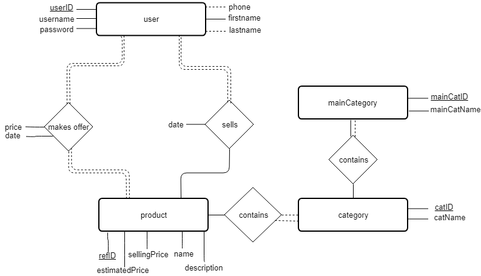

Projet final - Base de données
=======================================

## Sommaire :

1. [Diagramme Entité-Association](#section1)
2. [Modèle relationnel](#section2)
3. [Définition de la base de données](#section3)
4. [Ensemble des requêtes en SQL et explications des résultats attendus](#section4)
5. [Guide utilisateur](#section5)

## 1. Diagramme Entité-Association

## 2. Modèle relationnel

* User(__userID__, username, password, firstname, lastname, phone) 

* Product(__refID__, #userID, #categoryID, estimatedPrice, sellingPrice, name, description, date) 

* Offer(__offerID__, #userID, #productID, price, date) 

* MainCategory(__mainCategoryID__, name) 

* Category(__categoryID__, #mainCategoryID, name) 

* SoldProducts(__id__, #sellerID, #buyerID, #categoryID, estimatedPrice, sellingPrice, soldPrice, dateTransaction) 

SoldProducts est une table de __log__ conservant l'historique des produits vendus.
  

## 3. Définition de la base de données ([DDL.sql](DDL.sql))

~~~~sql
DROP TABLE IF EXISTS users, products, offers, maincategories, categories, soldproducts; 

CREATE TABLE users ( 
     userid      INT auto_increment, 
     username    VARCHAR(32) NOT NULL, 
     password    VARCHAR(32) NOT NULL, 
     firstname   VARCHAR(20) NOT NULL, 
     lastname    VARCHAR(20), 
     phonenumber VARCHAR(10), 
     PRIMARY KEY (userid), 
     UNIQUE (username) 
  ); 

CREATE TABLE products ( 
     refid          INT auto_increment, 
     estimatedprice NUMERIC(10, 2) NOT NULL, 
     sellingprice   NUMERIC(10, 2) NOT NULL, 
     sellerid       INT NOT NULL, 
     categoryid     INT NOT NULL,
     description    VARCHAR(150)    NOT NULL,
     name           VARCHAR(30)     NOT NULL,
     date           TIMESTAMP DEFAULT CURRENT_TIMESTAMP, 
     PRIMARY KEY (refid), 
     FOREIGN KEY (sellerid) REFERENCES users(userid), 
     FOREIGN KEY (categoryid) REFERENCES categories(categoryid) 
  );

CREATE TABLE offers ( 
     offerid   INT auto_increment, 
     buyerid   INT NOT NULL, 
     productid INT NOT NULL, 
     price     NUMERIC(10, 2) NOT NULL, 
     date      TIMESTAMP DEFAULT CURRENT_TIMESTAMP, 
     PRIMARY KEY (offerid), 
     FOREIGN KEY (buyerid) REFERENCES users(userid), 
     FOREIGN KEY (productid) REFERENCES products(refid) 
  ); 

CREATE TABLE maincategories ( 
     maincategoryid INT auto_increment, 
     name           INT NOT NULL, 
     PRIMARY KEY (maincategoryid) 
  ); 

CREATE TABLE categories ( 
     categoryid   INT auto_increment, 
     maincategory INT NOT NULL, 
     name         INT NOT NULL, 
     PRIMARY KEY (categoryid), 
     FOREIGN KEY (maincategory) REFERENCES maincategories(maincategoriesid) 
  ); 

CREATE TABLE soldproducts ( 
     id          		INT auto_increment, 
     sellerid    		INT NOT NULL,
     buyerid     		INT NOT NULL,
     categoryid     	INT NOT NULL,
     estimatedprice 	NUMERIC(10, 2) NOT NULL, 
     sellingprice   	NUMERIC(10, 2) NOT NULL, 
     soldprice   		NUMERIC(10, 2) NOT NULL, 
     dateTransaction	TIMESTAMP DEFAULT CURRENT_TIMESTAMP, 
     PRIMARY KEY (id), 
     FOREIGN KEY (sellerid) REFERENCES users(userid), 
     FOREIGN KEY (buyerid) 	REFERENCES users(userid), 
     FOREIGN KEY (categoryid) REFERENCES categories(categoryid) 
  );
~~~~

## 4. L'ensemble des requêtes en SQL et explications des résultats attendus

~~~~sql
SELECT * FROM offers;
~~~~

## 5. Guide utilisateur
