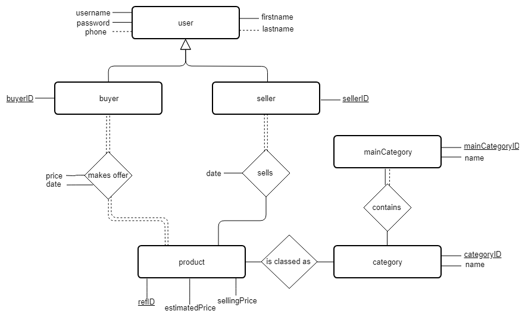

Projet final - Base de données
=======================================

Sommaire :

1. [Diagramme Entité-Association](#section1)
2.
3.
4. [Ensemble des requêtes en SQL et explications des résultats attendus](#section4)
5.

## 1. Diagramme Entité-Association  

## 2. Modèle relationnel 

* Buyer (__buyerID__,  username, password, firstname, lastname, phone) 

* Seller(__sellerID__, username, password, firstname, lastname, phone) 

* Product(__refID__, #sellerID, #categoryID, estimatedPrice, sellingPrice, date) 

* Offer(__offerID__, #buyerID, #productID, price, date) 

* MainCategory(__mainCategoryID__, name) 

* Category(__categoryID__, #mainCategoryID, name) 

## 3. Définition de la base de données ([DDL.sql](DDL.sql)) 

~~~~sql
DROP TABLE IF EXISTS buyers, sellers, products, offers, maincategories, categories; 

CREATE TABLE buyers ( 
     buyerid     INT auto_increment, 
     username    VARCHAR(32) NOT NULL, 
     password    VARCHAR(32) NOT NULL, 
     firstname   VARCHAR(20) NOT NULL, 
     lastname    VARCHAR(20), 
     phonenumber VARCHAR(10), 
     PRIMARY KEY (buyerid), 
     UNIQUE (username) 
  ); 

CREATE TABLE sellers ( 
     sellerid    INT auto_increment, 
     username    VARCHAR(32) NOT NULL, 
     password    VARCHAR(32) NOT NULL, 
     firstname   VARCHAR(20) NOT NULL, 
     lastname    VARCHAR(20), 
     phonenumber VARCHAR(10), 
     PRIMARY KEY (sellerid), 
     UNIQUE (username) 
  ); 

CREATE TABLE products ( 
     refid          INT auto_increment, 
     estimatedprice NUMERIC(10, 2) NOT NULL, 
     sellingprice   NUMERIC(10, 2) NOT NULL, 
     sellerid       INT NOT NULL, 
     categoryid     INT NOT NULL, 
     date           TIMESTAMP DEFAULT CURRENT_TIMESTAMP, 
     PRIMARY KEY (refid), 
     FOREIGN KEY (sellerid) REFERENCES sellers(sellerid), 
     FOREIGN KEY (categoryid) REFERENCES categories(categoryid) 
  );

CREATE TABLE offers ( 
     offerid   INT auto_increment, 
     buyerid   INT NOT NULL, 
     productid INT NOT NULL, 
     price     NUMERIC(10, 2) NOT NULL, 
     date      TIMESTAMP DEFAULT CURRENT_TIMESTAMP, 
     PRIMARY KEY (offerid), 
     FOREIGN KEY (buyerid) REFERENCES buyers(buyerid), 
     FOREIGN KEY (productid) REFERENCES products(refid) 
  ); 

CREATE TABLE maincategories ( 
     maincategoryid INT auto_increment, 
     name           INT NOT NULL, 
     PRIMARY KEY (maincategoryid) 
  ); 

CREATE TABLE categories ( 
     categoryid   INT auto_increment, 
     maincategory INT NOT NULL, 
     name         INT NOT NULL, 
     PRIMARY KEY (categoryid), 
     FOREIGN KEY (maincategory) REFERENCES maincategories(maincategoriesid) 
  ); 
~~~~

## 4. L'ensemble des requêtes en SQL et explications des résultats attendus 

~~~~sql
SELECT * FROM offers;
~~~~

## 5. Guide utilisateur 
